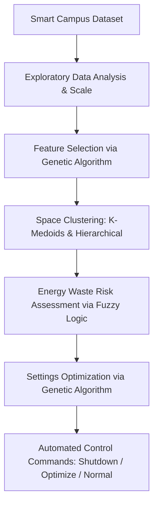

# 🏫 Smart Campus Energy Management System

An intelligent, multi-stage pipeline utilizing Machine Learning, Fuzzy Logic, and Genetic Algorithms to optimize energy consumption and minimize waste in campus facilities (Labs, Offices, Classrooms, etc.) in real-time.

---

## 👥 Team Members

* **Hossam Ahmed** (ID: 2405306)
* **Youssef Hamdy** (ID: 2405308)
* **Hana Adel** (ID: 2405345)
* **Asmaa Elshahat** (ID: 2305130)
* **Mostafa Amgad** (ID: 2405015)

---

## 📌 Project Overview

This project implements an automated, data-driven system to optimize energy utilization across campus facilities. Based on real-time monitoring of campus spaces, the system processes key features (occupancy, power draw, temperature, devices, network bandwidth, etc.) to perform clustering, assess energy waste risks, and run optimizations that command HVAC controls.

### 🗺️ System Architecture (Intelligent Pipeline)

The system is built as a multi-stage intelligent pipeline:



1. **Exploratory Data Analysis (EDA) & Prep**: Cleans, scales, and visualizes the dataset to understand relations between utilization patterns and power draw.
2. **Feature Selection (Genetic Algorithm)**: A custom-designed Genetic Algorithm (GA) selects the most important features (optimizing Silhouette Score on Agglomerative Clustering) to avoid dimensionality issues.
3. **Clustering (K-Medoids & Hierarchical Clustering)**: 
   * Groups campus areas based on usage behaviors using **K-Medoids** (Manhattan distance, Elbow Method selected optimal $K = 3$).
   * Uses **Agglomerative Hierarchical Clustering** (Euclidean, Ward linkage) to generate dendrograms and compare cluster performance.
4. **Risk Assessment (Fuzzy Inference System)**: Evaluates the "Energy Waste Risk" of each space by combining variables like space utilization and power consumption using a 9-rule Mamdani Fuzzy Logic System.
5. **Optimization (Genetic Algorithm)**: Finds the best temperature and HVAC settings to minimize the energy waste risk for spaces flagged as high risk.
6. **Automated Control Decisions**: Assigns final operational actions for each space:
   * 🛑 **Shutdown**: Turn off systems in unoccupied spaces.
   * ⚙️ **Optimize**: Calibrate setpoints for high-waste-risk zones.
   * ✅ **Normal**: Maintain default profiles for optimally running zones.

---

## 📊 Dataset Description

The dataset represents real-time telemetry from campus facilities. Key attributes include:
* **Space & Zone IDs**: Location identifiers.
* **Utilization Metrics**: capacity, occupancy count, utilization ratio, idle minutes.
* **Energy Metrics**: power consumption (`power_kwh`), power draw, voltage variation.
* **Network & Compute Metrics**: connected devices, bandwidth usage, packet loss rate.
* **Environmental Metrics**: indoor temperature, outdoor temperature index, device temperature.

*The feature selection algorithm reduced the data to 9 optimal features, including occupancy count, power consumption, HVAC state, and capacity.*

---

## 🛠️ Technology Stack

* **Language**: Python
* **Environment**: Jupyter Notebook
* **Key Libraries**:
  * Data Processing: `pandas`, `numpy`
  * Machine Learning & Clustering: `scikit-learn`, `scikit-learn-extra` (for K-Medoids)
  * Fuzzy Logic: `scikit-fuzzy`
  * Visualization: `matplotlib`, `seaborn`

---

## 📂 File Directory

* **[Project DM.ipynb](file:///d:/projrct%20Dm/Project%20DM.ipynb)**: The main Jupyter Notebook implementing the complete data science and optimization pipeline.
* **[Smart_Campus_Report.pdf](file:///d:/projrct%20Dm/Smart_Campus_Report.pdf)**: Detailed project report outlining the algorithms, methodology, and results.

---

## 🚀 How to Run

1. **Clone the repository**:
   ```bash
   git clone https://github.com/your-username/smart-campus-energy-management.git
   cd smart-campus-energy-management
   ```
2. **Install dependencies**:
   ```bash
   pip install numpy pandas scikit-fuzzy scikit-learn scikit-learn-extra matplotlib seaborn
   ```
3. **Run the notebook**:
   Open Jupyter Lab/Notebook and run `Project DM.ipynb` step-by-step:
   ```bash
   jupyter notebook "Project DM.ipynb"
   ```
